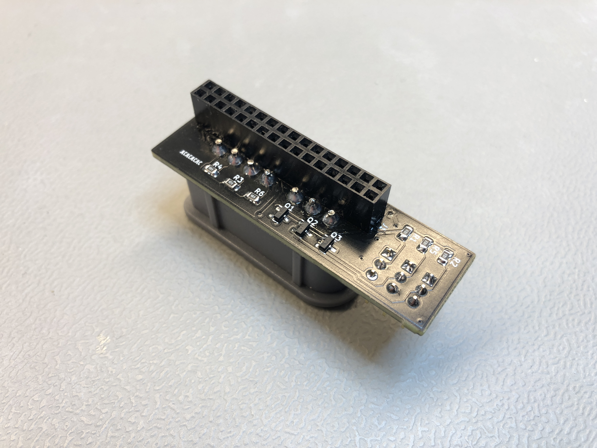

# Agon Joystick interface

## PINOUT ESP32
- DATA -> ESPI35
- LATCH <- ESPIO26
- CLK <- ESPIO27

## PINOUT ez80
- DATA -> PC1 
- LATCH <- PC2
- CLK <- PC0

## To do
- Order a PCB with the option 'specify location for order number', sigh
- Solder the headers straight next time
- Remove the ESP32 side as this will not be used in the future
- Create some sort of 3d printed bracket/housing for the connector